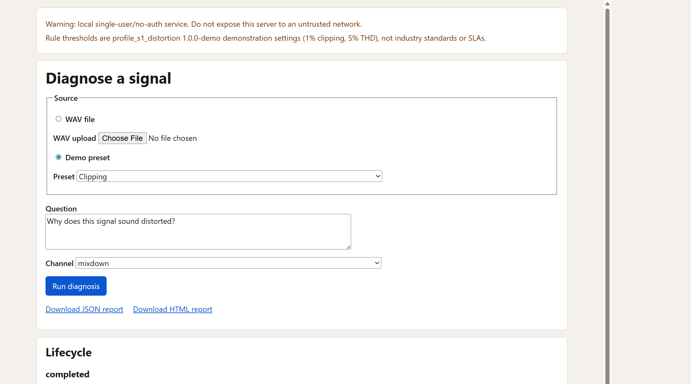
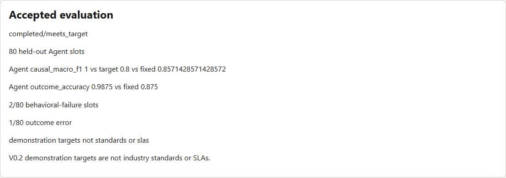
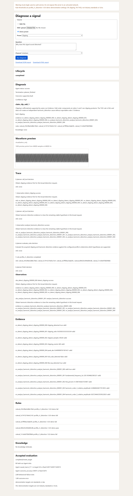

# Signal Diagnosis Agent

> 对照英文原件 [README.md](README.md)，以英文契约为准。

可复现、可评测、可交互的窄域 Agent，回答：
**“Why does this periodic signal sound distorted?”**（为什么这个周期信号听起来失真？）

产品路径使用真实 LLM 动态选择 DSP、规则与知识动作。确定性 DSP 拥有每一项数值结果，版本化 profile 拥有阈值，每一个受支持的诊断都必须引用同次运行（same-run）证据。脚本化 planner 可注入，用于状态机与工具执行测试；它绝不是静默的产品回退路径。

> V0.2 是简历级可演示垂直切片，不是生产级音频 QA、芯片验证或标准符合性产品。





<details>
<summary>打开完整诊断、trace、Evidence、规则与知识截图</summary>



</details>

## 已实现内容

- 合成周期信号与有界整数 PCM WAV 输入。
- 确定性削波（clipping）、频谱、基频与谐波分析。
- 紧凑 Evidence 适配器；原始波形与完整 FFT 数组永不进入 LLM。
- 动态 `RealLLMPlanner` 决策，带观察驱动重规划与显式停止。
- 版本化 PASS/FAIL/NOT_APPLICABLE 规则，以及策展后的本地知识索引。
- 脚本化确定性验收，外加相对诚实固定流水线的独立真实模型行为评测。
- 同一应用服务经 argparse CLI、FastAPI、原生 Web UI、JSON 与自包含 HTML 报告对外暴露。

## 架构

```text
signal -> dsp -> tools -> rules/knowledge -> agent -> evaluation -> app
```

```text
CLI / Web UI / API
        |
DiagnosisApplicationService
        |
DistortionDiagnosisRuntime <-> RealLLMPlanner
        |
SignalToolService -> deterministic DSP -> Evidence
        |
RuleEngine / KnowledgeIndex
        |
StructuredDiagnosis -> JSON / HTML / UI
```

依赖方向由架构测试强制执行。`signal`、`dsp`、`tools`、`rules` 与 `knowledge` 不依赖 Agent 或 LLM 框架。

## 已验证结果

V0.2 终端状态：

```text
presentation_harness_accepted
real_demo_completed
Phase 5 accepted; V0.2 complete resume-grade demonstrable vertical slice
```

确定性验收：

- T001–T285：**1006 passed**，零必需 skip/xfail。
- 本地干净环境矩阵：CPython **3.11** 与 **3.12**。
- Ruff、mypy、架构检查、diff-check 与 wheel smoke 均通过。
- 托管 GitHub Actions 为可选，未作为验收输入使用。

官方真实模型行为评测：

- DeepSeek `deepseek-v4-flash`，公开 `RealLLMPlanner`，prompt
  `v0.2-s1-planner-8.1`。
- 数据集 `s1-distortion-synthetic` 1.2.0，scoring 2.0.0。
- 开发门禁：40 个 Agent slots，40/40 正确 outcome，全部 11 个目标
  band 通过。该 split 用于行为开发，不是留出（held-out）证据。
- 80 个留出 Agent slots：`completed/meets_target`。
- Causal macro F1 1.0；evidence grounding 1.0；first-tool selection 1.0；
  timely stopping 1.0；unnecessary Tool action rate 0.0；unsupported claim
  rate 0.0。
- Outcome accuracy 79/80。两个 slots 含已披露的非阻塞行为失败码；其中
  一个是唯一错误 outcome。这些事实在 UI 与已提交评测包中保持可见。

首次 Phase 4 官方基准以及 v5–v8 开发未达标结果仍保留提交。它们是工程证据，不是被隐藏或改写的结果。

## 增量外部/情境验证

V0.2 验收之后，一项独立增量研究审视了主要外部有效性局限：已接受的官方数据集是合成的。首次 V0.2 外部 WAV 活动使用了公开录音与受控失真，但仍为 `below_target`，主要因为单 WAV 的 THD 证据无法可靠区分新引入的谐波失真与录音中本已存在的谐波成分。该结果仍被保留。

V0.3 在不超出 Scenario S1 的前提下，增加了显式 `paired_reference` 与 `nominal_single_tone` 上下文。其冻结的 v9.11 验证在三个臂上共跑了 20 个 cases（合计 60 slots）：情境 Agent、无真相固定流水线，以及无上下文消融。在对两个错误实现的 claim 级评分分母做了仅追加（append-only）修正之后，情境 Agent 满足了每一项预注册的聚合与角色门禁：

- planner completion 19/20；
- outcome 与 causal exact-set accuracy 16/17；
- causal macro-F1 0.955；
- harmonic recall 5/5 与 clipping recall 5/6；
- evidence grounding 21/21 与 unsupported positive claims 0/10；
- 相对无上下文消融的配对谐波因果优势：+4 cases。

原始生成的 `below_target` 文件、评分器缺陷、修正实现，以及仅追加的 `meets_target` 裁决全部保留。这是小规模外部/情境验证，不是官方基准、工业验证、生产认证，也不是 V0.2 的替代。见 [v9.11 validation acceptance report](docs/evaluations/v0_3/contextual/V9_11_CONTEXTUAL_VALIDATION_ACCEPTANCE_REPORT.md)。

## 安装

需要 Python 3.11 或 3.12。

```text
python -m pip install --upgrade pip
python -m pip install ".[app,llm]"
```

用于测试与打包：

```text
python -m pip install ".[app,llm,dev]"
```

核心 DSP/rules/knowledge/agent 安装仍为 `pip install .`，不会拉取 FastAPI。

## 运行本地 Demo

产品 planner 需要本地 DeepSeek API key。切勿提交该密钥。

```text
set DEEPSEEK_API_KEY=<your-key>
signal-diag serve --host 127.0.0.1 --port 8765
```

打开 `http://127.0.0.1:8765`。保留 Demo 使用端口 8765，因为验收机器上端口 8000 不可用。

健康检查端点、presets、已接受评测摘要与静态 UI 无需凭证即可加载。无凭证提交诊断会返回配置错误；产品路径不会回退到 `ScriptedPlanner`。

**这是本地、单用户、无鉴权服务。切勿将其暴露到不可信网络。**

## CLI

```text
signal-diag presets
signal-diag diagnose synthetic clipping
signal-diag diagnose wav path\to\file.wav
signal-diag diagnose wav path\to\file.wav --channel mixdown --output json --html-output report.html
```

默认问题：“Why does this signal sound distorted?” 默认通道：
mixdown。Exit 0 表示有效的已完成 Agent 结果，包括 inconclusive 或
no-supported-fault。Exit 1 表示 Agent/runtime 或应用失败。Exit 2
表示用法、输入或配置错误。

## WAV 边界

- Little-endian RIFF/WAVE，整数 PCM 或带 PCM subtype 的 extensible PCM。
- 8/16/24/32 bit，单声道或立体声，8 kHz–192 kHz。
- 最大 20 MiB、2,000,000 frames、以及 30 秒。
- 精确满量程 `float32` 转换；无逐信号峰值归一化。
- RIFX、RF64、IEEE float、压缩，以及超过两个声道均被拒绝。

## 从何处阅读代码

沿一次请求纵向阅读，而不是通读每一个模块：

1. `src/signal_diag/app/cli.py` 与 `app/composition.py` — 产品入口与
   依赖组装。
2. `app/service.py` — WAV/preset 请求到一次 Agent 运行。
3. `agent/models.py`、`agent/planner.py` 与 `agent/runtime.py` — 决策、
   模型边界、状态机、限制与终止。
4. `tools/service.py` 进入 `dsp/clipping.py` 或 `dsp/harmonics.py` — 确定性
   计算变为 Evidence。
5. `rules/engine.py` 与 `knowledge/index.py` — 配置化判定与
   确定性检索。
6. `evaluation/runner.py` 与 `evaluation/scoring.py` — 确定性与实况
   评测。
7. `tests/agent/test_s1_acceptance.py` 与
   `tests/test_architecture_boundaries.py` — 端到端契约与依赖
   证明。

评审者、开发者与历史阅读路径见 [documentation index](docs/README.md)。

## 证据与报告

- [Engineering case study](docs/PROJECT_CASE_STUDY.md)
- [Phase 5 real Demo artifacts](docs/demo/phase5/v0_2_acceptance/README.md)
- [Accepted official Phase 4.3.1 bundle](docs/evaluations/phase4_3_1/official/bench_official_s1_v12_planner8_1_gate5/)
- [Architecture](docs/ARCHITECTURE_V0_2.md)
- [Frozen contracts](docs/CONTRACTS_V0_2.md)
- [Acceptance plan T001–T285](docs/TEST_PLAN_V0_2.md)
- [Design decisions D001–D031](docs/DECISIONS.md)

## 诚实局限

- 仅 S1 失真；这不是通用音频或硬件测试平台。
- 支持合成 cases 与有界 PCM WAV；任意生产采集不是经验证语料。
- F0 是自相关基线，不是通用音高跟踪器。
- 规则 profile `profile_s1_distortion` 1.0.0-demo 使用 1% clipping 与 5% THD
  演示设置，不是行业标准或 SLA。
- 仅本地、无鉴权、无数据库、无 Docker、无向量检索，也
  无多 Agent runtime。
- 已接受的官方运行仍披露 80 中有两个行为编码 slots 与一个
  错误 outcome。
- V0.2 外部 WAV 增量仍为 `below_target`；随后的 v9.11
  情境结果仅适用于其冻结的 20-case 研究，并包含一个
  保留的行为失败。
